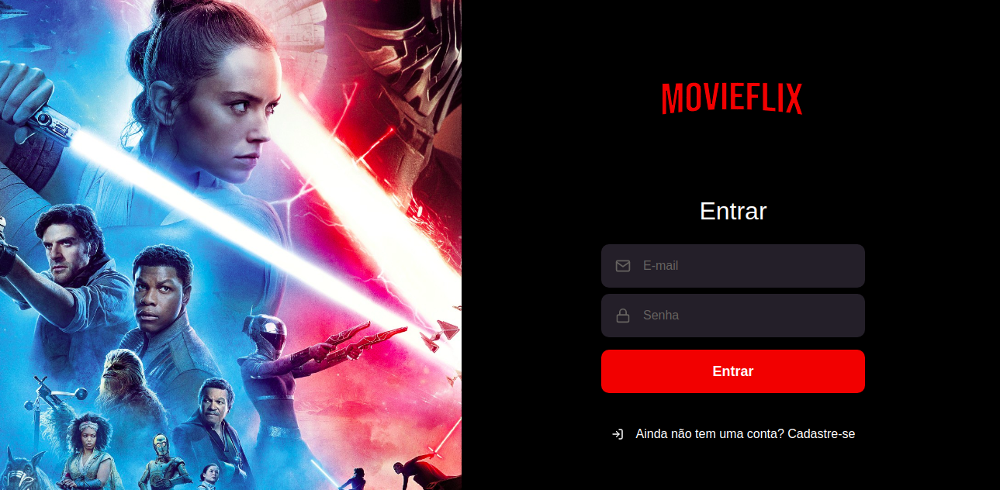
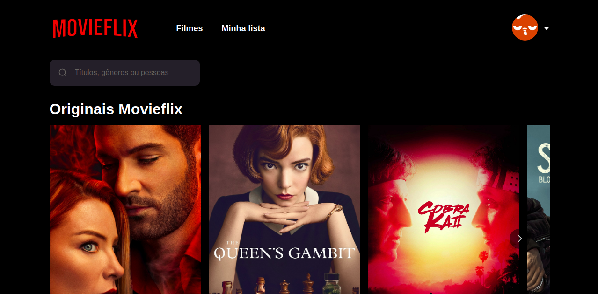

# Introdução

Movieflix - Aplicação para listagem de filmes (API https://themoviedb.org).

# Sobre o build

O app foi criado com a utilização das seguintes ferramentas:

Frontend:
- React;
- React-Router-Dom;
- Redux
- Typescript;
- Axios;
- Styled-components

# Execução

Frontend:

- Clonar esse repositório com o comando: https://github.com/LuizHonorato/movieflix.git

- É necessário criar uma conta no The MovieDB, ir até o menu, opção Configuração, na página de configuração ir até a opção API e gerar uma nova chave.

- Copiar o arquivo .env.example na raíz do projeto e renomea-lo para .env e colar na chave de ambiente REACT_APP_MOVIEDB_API_KEY a chave da API do The MovieDB gerado no passo anterior.

- Após a configuração anterior, navegar até a pasta do projeto via linha de comando e iniciar o mesmo com npm start ou yarn start, conforme o seu ambiente.

# Screenshots

